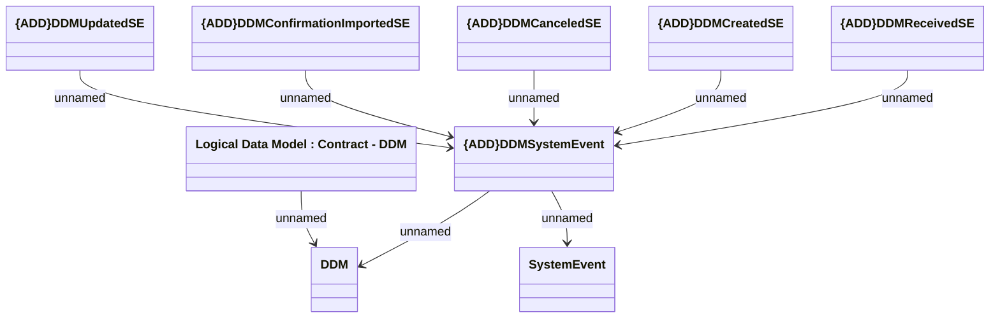

# DDMSystemEvent schema

```mermaid
classDiagram
    class ADD_DDMConfirmationImportedSE["{ADD}DDMConfirmationImportedSE"]
    class ADD_DDMReceivedSE["{ADD}DDMReceivedSE"]
    class ADD_DDMCanceledSE["{ADD}DDMCanceledSE"]
    class ADD_DDMUpdatedSE["{ADD}DDMUpdatedSE"]
    class ADD_DDMCreatedSE["{ADD}DDMCreatedSE"]
    class Logical_Data_Model_Contract_DDM["Logical Data Model : Contract - DDM"]
    class DDM["DDM"]
    class ADD_DDMSystemEvent["{ADD}DDMSystemEvent"]
    class SystemEvent["SystemEvent"]
    ADD_DDMSystemEvent --> SystemEvent : unnamed
    ADD_DDMReceivedSE --> ADD_DDMSystemEvent : unnamed
    ADD_DDMCreatedSE --> ADD_DDMSystemEvent : unnamed
    ADD_DDMCanceledSE --> ADD_DDMSystemEvent : unnamed
    ADD_DDMConfirmationImportedSE --> ADD_DDMSystemEvent : unnamed
    ADD_DDMUpdatedSE --> ADD_DDMSystemEvent : unnamed
    Logical_Data_Model_Contract_DDM --> DDM : unnamed
    ADD_DDMSystemEvent --> DDM : unnamed
```
