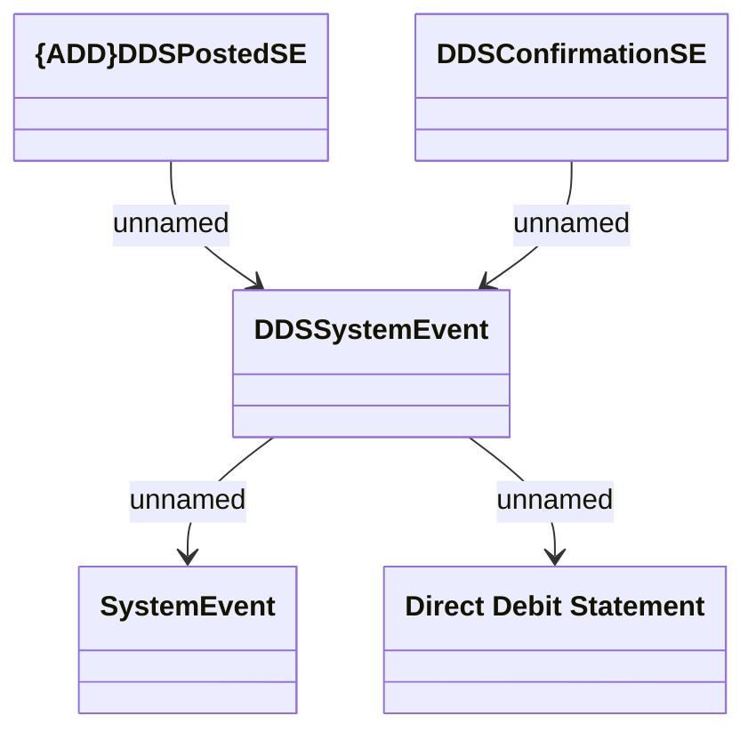

# DDSSystemEvent schema

```mermaid
classDiagram
    class ADD_DDSPostedSE["{ADD}DDSPostedSE"]
    class Direct_Debit_Statement["Direct Debit Statement"]
    class DDSSystemEvent["DDSSystemEvent"]
    class DDSConfirmationSE["DDSConfirmationSE"]
    class SystemEvent["SystemEvent"]
    DDSSystemEvent --> SystemEvent : unnamed
    ADD_DDSPostedSE --> DDSSystemEvent : unnamed
    DDSConfirmationSE --> DDSSystemEvent : unnamed
    DDSSystemEvent --> Direct_Debit_Statement : unnamed
```
