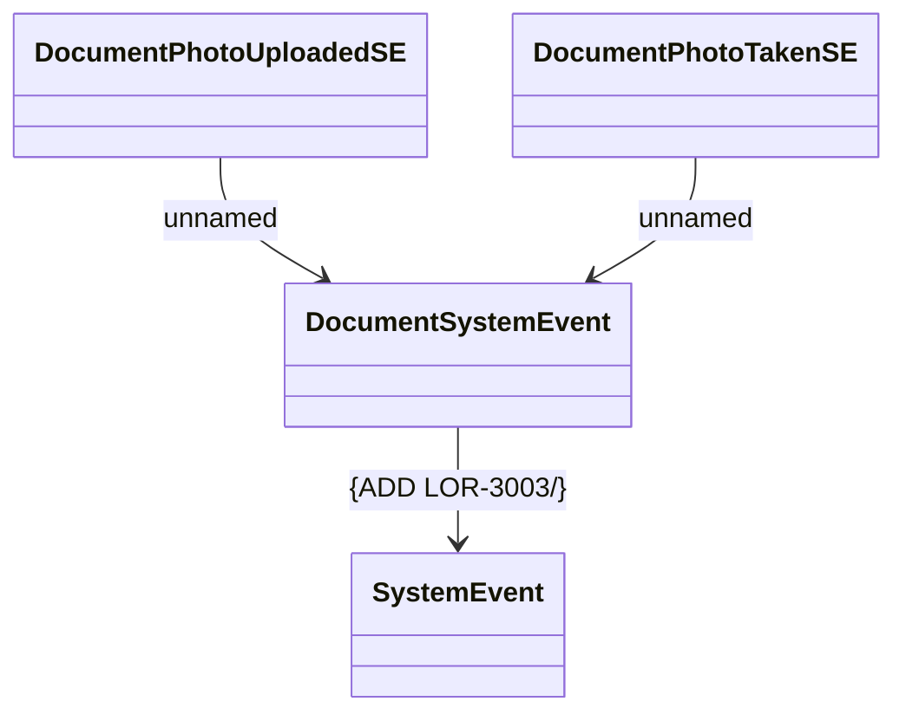

# DocumentSystemEvent schema

```mermaid
classDiagram
    class SystemEvent["SystemEvent"]
    class DocumentPhotoUploadedSE["DocumentPhotoUploadedSE"]
    class DocumentPhotoTakenSE["DocumentPhotoTakenSE"]
    class DocumentSystemEvent["DocumentSystemEvent"]
    DocumentPhotoUploadedSE --> DocumentSystemEvent : unnamed
    DocumentPhotoTakenSE --> DocumentSystemEvent : unnamed
    DocumentSystemEvent --> SystemEvent : {ADD LOR-3003/}
```
