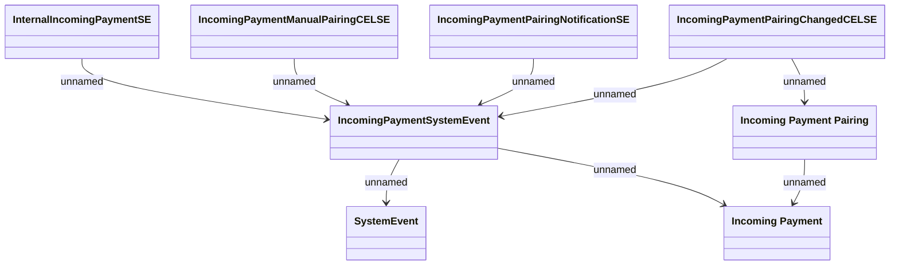

# IncomingPaymentSystemEvent schema

```mermaid
classDiagram
    class IncomingPaymentPairingNotificationSE["IncomingPaymentPairingNotificationSE"]
    class IncomingPaymentManualPairingCELSE["IncomingPaymentManualPairingCELSE"]
    class Incoming_Payment_Pairing["Incoming Payment Pairing"]
    class Incoming_Payment["Incoming Payment"]
    class IncomingPaymentPairingChangedCELSE["IncomingPaymentPairingChangedCELSE"]
    class IncomingPaymentSystemEvent["IncomingPaymentSystemEvent"]
    class InternalIncomingPaymentSE["InternalIncomingPaymentSE"]
    class SystemEvent["SystemEvent"]
    IncomingPaymentSystemEvent --> SystemEvent : unnamed
    InternalIncomingPaymentSE --> IncomingPaymentSystemEvent : unnamed
    IncomingPaymentManualPairingCELSE --> IncomingPaymentSystemEvent : unnamed
    IncomingPaymentPairingNotificationSE --> IncomingPaymentSystemEvent : unnamed
    IncomingPaymentPairingChangedCELSE --> IncomingPaymentSystemEvent : unnamed
    IncomingPaymentSystemEvent --> Incoming_Payment : unnamed
    Incoming_Payment_Pairing --> Incoming_Payment : unnamed
    IncomingPaymentPairingChangedCELSE --> Incoming_Payment_Pairing : unnamed
```
