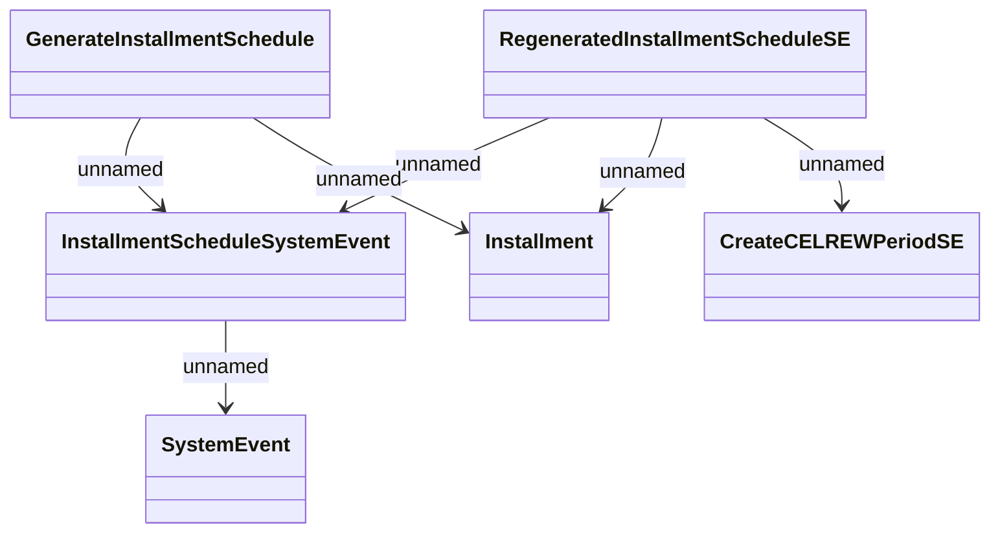

# InstallmentScheduleSystemEvent schema

```mermaid
classDiagram
    class GenerateInstallmentSchedule["GenerateInstallmentSchedule"]
    class CreateCELREWPeriodSE["CreateCELREWPeriodSE"]
    class Installment["Installment"]
    class RegeneratedInstallmentScheduleSE["RegeneratedInstallmentScheduleSE"]
    class SystemEvent["SystemEvent"]
    class InstallmentScheduleSystemEvent["InstallmentScheduleSystemEvent"]
    GenerateInstallmentSchedule --> InstallmentScheduleSystemEvent : unnamed
    RegeneratedInstallmentScheduleSE --> InstallmentScheduleSystemEvent : unnamed
    InstallmentScheduleSystemEvent --> SystemEvent : unnamed
    GenerateInstallmentSchedule --> Installment : unnamed
    RegeneratedInstallmentScheduleSE --> Installment : unnamed
    RegeneratedInstallmentScheduleSE --> CreateCELREWPeriodSE : unnamed
```
