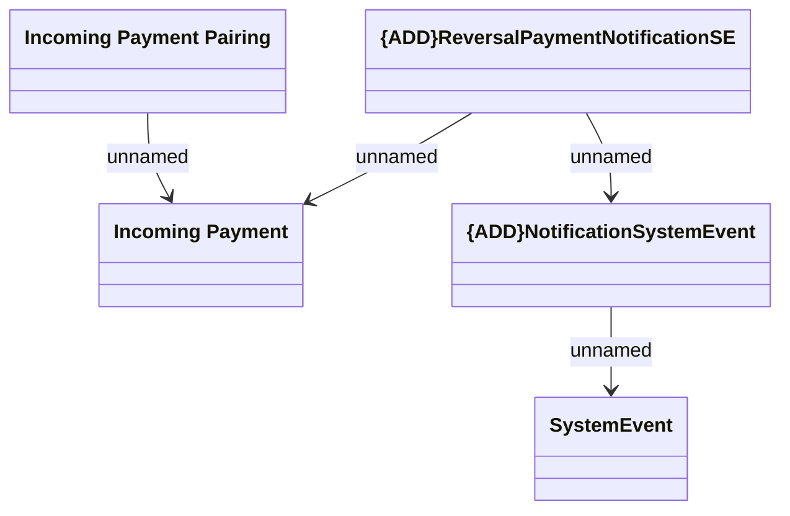

# Notification system event schema

```mermaid
classDiagram
    class Incoming_Payment_Pairing["Incoming Payment Pairing"]
    class Incoming_Payment["Incoming Payment"]
    class ADD_ReversalPaymentNotificationSE["{ADD}ReversalPaymentNotificationSE"]
    class SystemEvent["SystemEvent"]
    class ADD_NotificationSystemEvent["{ADD}NotificationSystemEvent"]
    ADD_ReversalPaymentNotificationSE --> ADD_NotificationSystemEvent : unnamed
    ADD_NotificationSystemEvent --> SystemEvent : unnamed
    Incoming_Payment_Pairing --> Incoming_Payment : unnamed
    ADD_ReversalPaymentNotificationSE --> Incoming_Payment : unnamed
```
