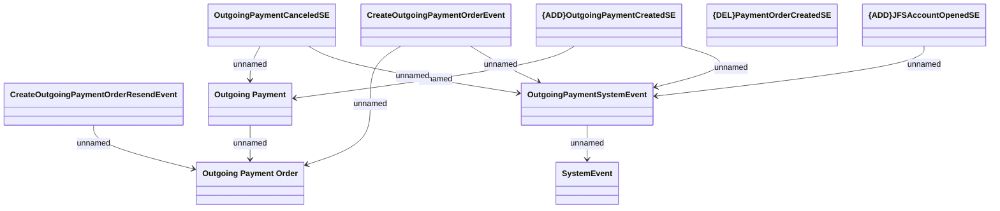

# OutgoingPaymentSystemEvent

```mermaid
classDiagram
    class CreateOutgoingPaymentOrderResendEvent["CreateOutgoingPaymentOrderResendEvent"]
    class CreateOutgoingPaymentOrderEvent["CreateOutgoingPaymentOrderEvent"]
    class ADD_JFSAccountOpenedSE["{ADD}JFSAccountOpenedSE"]
    class ADD_OutgoingPaymentCreatedSE["{ADD}OutgoingPaymentCreatedSE"]
    class Outgoing_Payment_Order["Outgoing Payment Order"]
    class Outgoing_Payment["Outgoing Payment"]
    class DEL_PaymentOrderCreatedSE["{DEL}PaymentOrderCreatedSE"]
    class OutgoingPaymentSystemEvent["OutgoingPaymentSystemEvent"]
    class OutgoingPaymentCanceledSE["OutgoingPaymentCanceledSE"]
    class SystemEvent["SystemEvent"]
    ADD_OutgoingPaymentCreatedSE --> Outgoing_Payment : unnamed
    OutgoingPaymentCanceledSE --> Outgoing_Payment : unnamed
    Outgoing_Payment --> Outgoing_Payment_Order : unnamed
    CreateOutgoingPaymentOrderEvent --> Outgoing_Payment_Order : unnamed
    CreateOutgoingPaymentOrderResendEvent --> Outgoing_Payment_Order : unnamed
    OutgoingPaymentSystemEvent --> SystemEvent : unnamed
    OutgoingPaymentCanceledSE --> OutgoingPaymentSystemEvent : unnamed
    CreateOutgoingPaymentOrderEvent --> OutgoingPaymentSystemEvent : unnamed
    ADD_JFSAccountOpenedSE --> OutgoingPaymentSystemEvent : unnamed
    ADD_OutgoingPaymentCreatedSE --> OutgoingPaymentSystemEvent : unnamed
```
