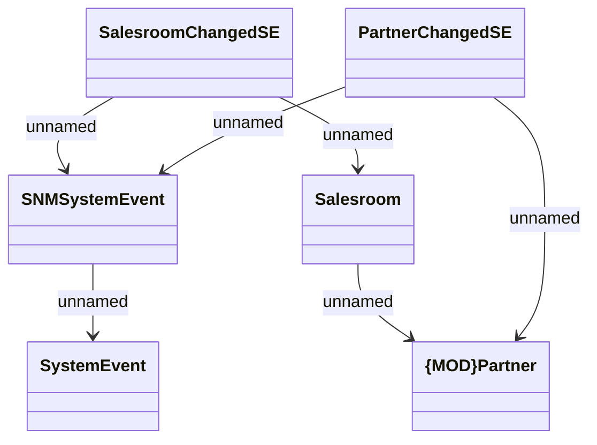

# SNMSystemEvent

```mermaid
classDiagram
    class MOD_Partner["{MOD}Partner"]
    class Salesroom["Salesroom"]
    class SNMSystemEvent["SNMSystemEvent"]
    class PartnerChangedSE["PartnerChangedSE"]
    class SalesroomChangedSE["SalesroomChangedSE"]
    class SystemEvent["SystemEvent"]
    SNMSystemEvent --> SystemEvent : unnamed
    SalesroomChangedSE --> SNMSystemEvent : unnamed
    PartnerChangedSE --> SNMSystemEvent : unnamed
    SalesroomChangedSE --> Salesroom : unnamed
    Salesroom --> MOD_Partner : unnamed
    PartnerChangedSE --> MOD_Partner : unnamed
```
