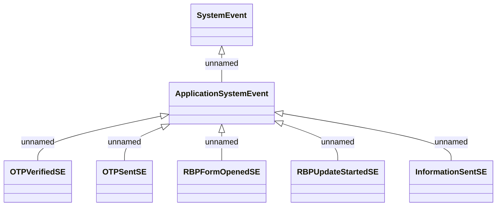

# Application system events - RBP

- **Diagram Type**: Logical
- **Package**: HomerSelect/BSL/Analysis Model/COMMON for BSL/System events/Logical data model/Application system events
- **Diagram ID**: 158383
- **Elements**: 7
- **Connectors**: 6

