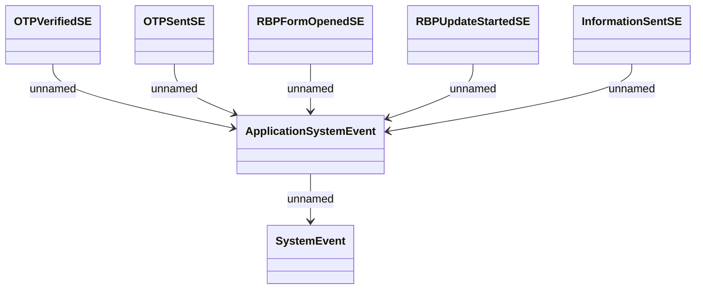

# Application system events - RBP

```mermaid
classDiagram
    class InformationSentSE["InformationSentSE"]
    class RBPUpdateStartedSE["RBPUpdateStartedSE"]
    class RBPFormOpenedSE["RBPFormOpenedSE"]
    class OTPSentSE["OTPSentSE"]
    class OTPVerifiedSE["OTPVerifiedSE"]
    class SystemEvent["SystemEvent"]
    class ApplicationSystemEvent["ApplicationSystemEvent"]
    ApplicationSystemEvent --> SystemEvent : unnamed
    OTPVerifiedSE --> ApplicationSystemEvent : unnamed
    OTPSentSE --> ApplicationSystemEvent : unnamed
    RBPFormOpenedSE --> ApplicationSystemEvent : unnamed
    RBPUpdateStartedSE --> ApplicationSystemEvent : unnamed
    InformationSentSE --> ApplicationSystemEvent : unnamed
```
