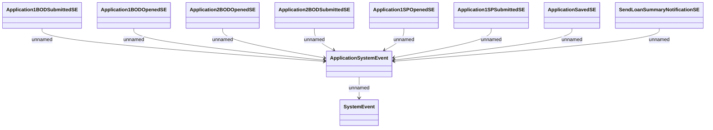

# Application system events - application form

```mermaid
classDiagram
    class SystemEvent["SystemEvent"]
    class SendLoanSummaryNotificationSE["SendLoanSummaryNotificationSE"]
    class ApplicationSavedSE["ApplicationSavedSE"]
    class Application1SPSubmittedSE["Application1SPSubmittedSE"]
    class Application1SPOpenedSE["Application1SPOpenedSE"]
    class Application2BODSubmittedSE["Application2BODSubmittedSE"]
    class Application2BODOpenedSE["Application2BODOpenedSE"]
    class Application1BODOpenedSE["Application1BODOpenedSE"]
    class ApplicationSystemEvent["ApplicationSystemEvent"]
    class Application1BODSubmittedSE["Application1BODSubmittedSE"]
    Application1BODSubmittedSE --> ApplicationSystemEvent : unnamed
    ApplicationSystemEvent --> SystemEvent : unnamed
    Application1BODOpenedSE --> ApplicationSystemEvent : unnamed
    Application2BODOpenedSE --> ApplicationSystemEvent : unnamed
    Application2BODSubmittedSE --> ApplicationSystemEvent : unnamed
    Application1SPOpenedSE --> ApplicationSystemEvent : unnamed
    Application1SPSubmittedSE --> ApplicationSystemEvent : unnamed
    ApplicationSavedSE --> ApplicationSystemEvent : unnamed
    SendLoanSummaryNotificationSE --> ApplicationSystemEvent : unnamed
```
