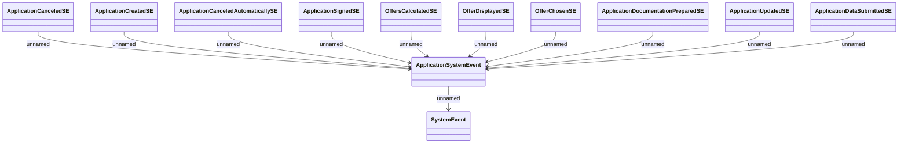

# Application system events - application process

```mermaid
classDiagram
    class ApplicationDataSubmittedSE["ApplicationDataSubmittedSE"]
    class ApplicationUpdatedSE["ApplicationUpdatedSE"]
    class ApplicationDocumentationPreparedSE["ApplicationDocumentationPreparedSE"]
    class OfferChosenSE["OfferChosenSE"]
    class OfferDisplayedSE["OfferDisplayedSE"]
    class OffersCalculatedSE["OffersCalculatedSE"]
    class ApplicationSignedSE["ApplicationSignedSE"]
    class ApplicationCanceledAutomaticallySE["ApplicationCanceledAutomaticallySE"]
    class ApplicationCreatedSE["ApplicationCreatedSE"]
    class ApplicationCanceledSE["ApplicationCanceledSE"]
    class SystemEvent["SystemEvent"]
    class ApplicationSystemEvent["ApplicationSystemEvent"]
    ApplicationSystemEvent --> SystemEvent : unnamed
    ApplicationCanceledSE --> ApplicationSystemEvent : unnamed
    ApplicationCreatedSE --> ApplicationSystemEvent : unnamed
    ApplicationCanceledAutomaticallySE --> ApplicationSystemEvent : unnamed
    ApplicationSignedSE --> ApplicationSystemEvent : unnamed
    OffersCalculatedSE --> ApplicationSystemEvent : unnamed
    OfferDisplayedSE --> ApplicationSystemEvent : unnamed
    OfferChosenSE --> ApplicationSystemEvent : unnamed
    ApplicationDocumentationPreparedSE --> ApplicationSystemEvent : unnamed
    ApplicationUpdatedSE --> ApplicationSystemEvent : unnamed
    ApplicationDataSubmittedSE --> ApplicationSystemEvent : unnamed
```
