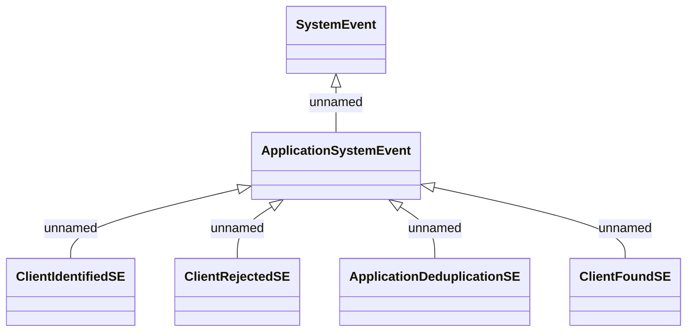

# Application system events - client

- **Diagram Type**: Logical
- **Package**: HomerSelect/BSL/Analysis Model/COMMON for BSL/System events/Logical data model/Application system events
- **Diagram ID**: 158382
- **Elements**: 6
- **Connectors**: 5

