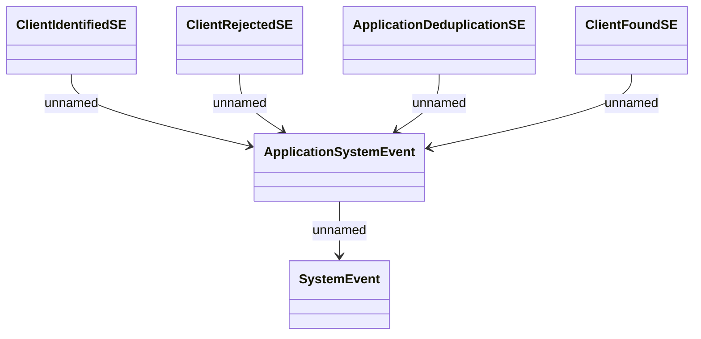

# Application system events - client

```mermaid
classDiagram
    class ClientFoundSE["ClientFoundSE"]
    class ApplicationDeduplicationSE["ApplicationDeduplicationSE"]
    class ClientRejectedSE["ClientRejectedSE"]
    class ClientIdentifiedSE["ClientIdentifiedSE"]
    class SystemEvent["SystemEvent"]
    class ApplicationSystemEvent["ApplicationSystemEvent"]
    ApplicationSystemEvent --> SystemEvent : unnamed
    ClientIdentifiedSE --> ApplicationSystemEvent : unnamed
    ClientRejectedSE --> ApplicationSystemEvent : unnamed
    ApplicationDeduplicationSE --> ApplicationSystemEvent : unnamed
    ClientFoundSE --> ApplicationSystemEvent : unnamed
```
