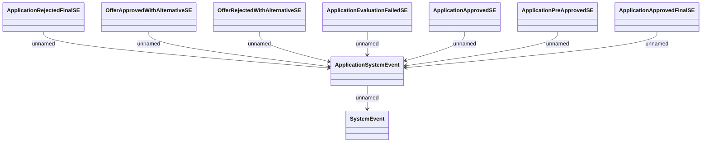

# Application system events - evaluation results

```mermaid
classDiagram
    class OfferRejectedWithAlternativeSE["OfferRejectedWithAlternativeSE"]
    class OfferApprovedWithAlternativeSE["OfferApprovedWithAlternativeSE "]
    class ApplicationRejectedFinalSE["ApplicationRejectedFinalSE"]
    class ApplicationApprovedFinalSE["ApplicationApprovedFinalSE"]
    class ApplicationPreApprovedSE["ApplicationPreApprovedSE"]
    class ApplicationApprovedSE["ApplicationApprovedSE"]
    class ApplicationEvaluationFailedSE["ApplicationEvaluationFailedSE"]
    class SystemEvent["SystemEvent"]
    class ApplicationSystemEvent["ApplicationSystemEvent"]
    ApplicationRejectedFinalSE --> ApplicationSystemEvent : unnamed
    OfferApprovedWithAlternativeSE --> ApplicationSystemEvent : unnamed
    OfferRejectedWithAlternativeSE --> ApplicationSystemEvent : unnamed
    ApplicationSystemEvent --> SystemEvent : unnamed
    ApplicationEvaluationFailedSE --> ApplicationSystemEvent : unnamed
    ApplicationApprovedSE --> ApplicationSystemEvent : unnamed
    ApplicationPreApprovedSE --> ApplicationSystemEvent : unnamed
    ApplicationApprovedFinalSE --> ApplicationSystemEvent : unnamed
```
