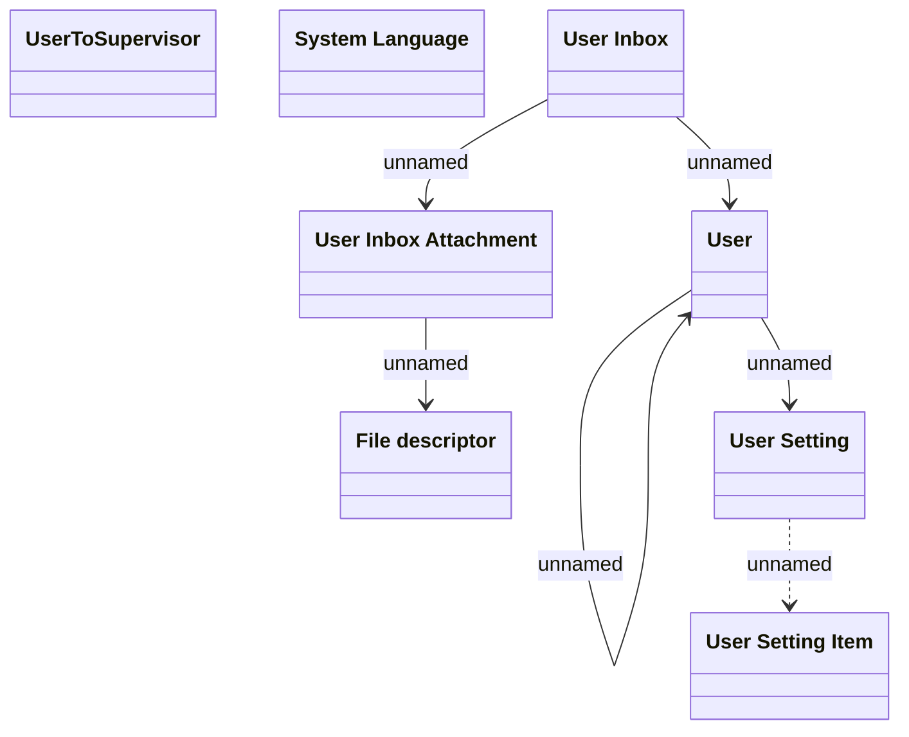

# Common - User

- **Diagram Type**: Logical
- **Package**: HomerSelect/BSL/Analysis Model/COMMON for BSL/User settings/Logical Data Model
- **Diagram ID**: 132931
- **Elements**: 8
- **Connectors**: 6

