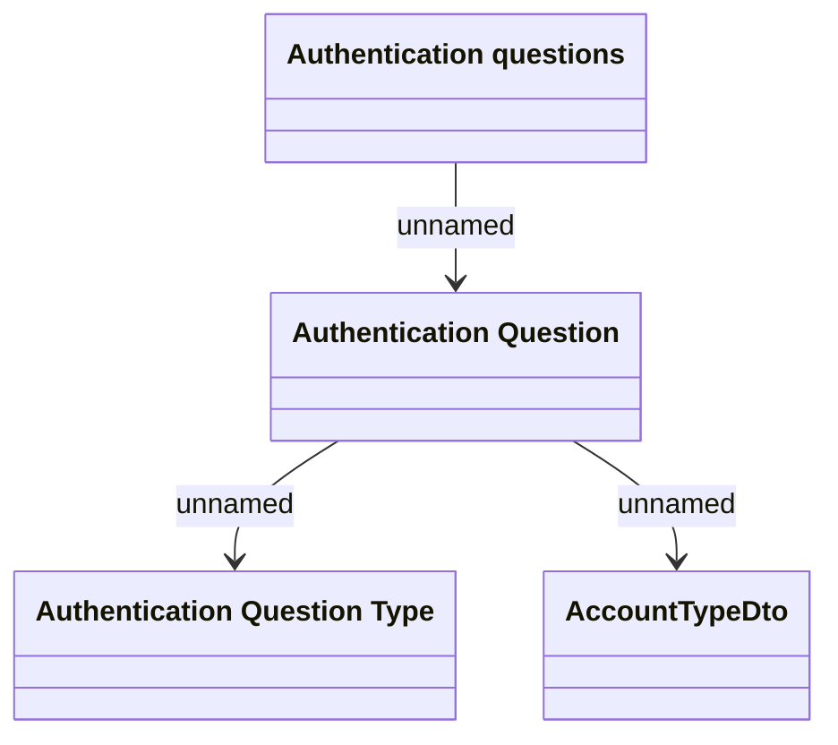

# Authentication questions

```mermaid
classDiagram
    class AccountTypeDto["AccountTypeDto"]
    class Authentication_Question["Authentication Question"]
    class Authentication_Question_Type["Authentication Question Type"]
    class Authentication_questions["Authentication questions"]
    Authentication_Question --> Authentication_Question_Type : unnamed
    Authentication_Question --> AccountTypeDto : unnamed
    Authentication_questions --> Authentication_Question : unnamed
```
