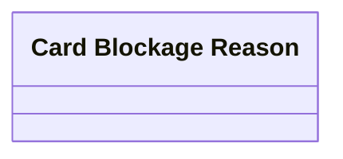

# Blocking reasons configuration

- **Diagram Type**: Logical
- **Package**: HomerSelect/BSL/Analysis Model/Card management support/Card operations/Logical data model
- **Diagram ID**: 134517
- **Elements**: 1
- **Connectors**: 0

