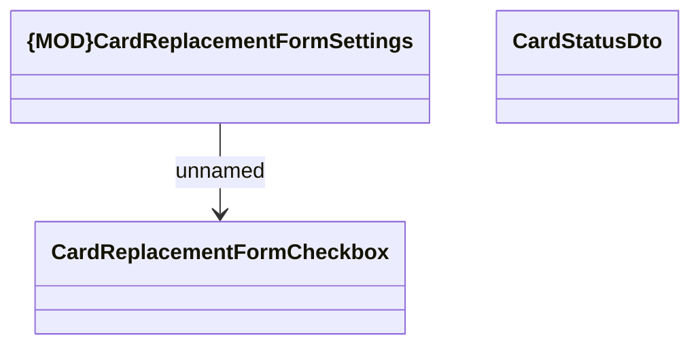

# CardReplacementFormSettings

```mermaid
classDiagram
    class CardReplacementFormCheckbox["CardReplacementFormCheckbox"]
    class MOD_CardReplacementFormSettings["{MOD}CardReplacementFormSettings"]
    class CardStatusDto["CardStatusDto"]
    MOD_CardReplacementFormSettings --> CardReplacementFormCheckbox : unnamed
```
