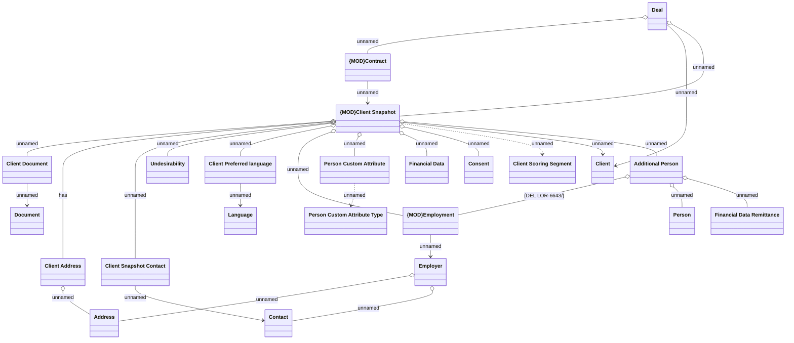

# Client management

- **Diagram Type**: Logical
- **Package**: HomerSelect/BSL/Analysis Model/Client Management/COMMON for Client Management/Logical Data Model
- **Diagram ID**: 151429
- **Elements**: 23
- **Connectors**: 27

