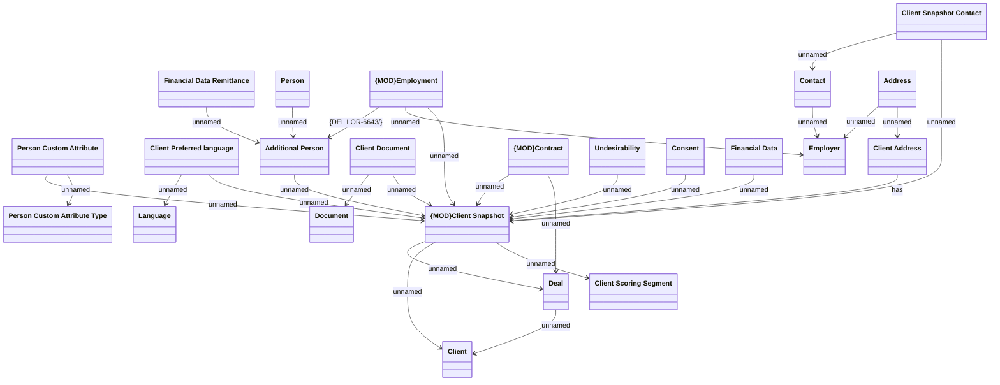

# Client management

```mermaid
classDiagram
    class Client_Scoring_Segment["Client Scoring Segment"]
    class Person_Custom_Attribute_Type["Person Custom Attribute Type"]
    class Person_Custom_Attribute["Person Custom Attribute"]
    class Financial_Data_Remittance["Financial Data Remittance"]
    class MOD_Client_Snapshot["{MOD}Client Snapshot"]
    class Language["Language"]
    class Client_Snapshot_Contact["Client Snapshot Contact"]
    class Client_Preferred_language["Client Preferred language"]
    class Client_Address["Client Address"]
    class Client["Client"]
    class Client_Document["Client Document"]
    class Deal["Deal"]
    class Person["Person"]
    class Document["Document"]
    class Employer["Employer"]
    class MOD_Contract["{MOD}Contract"]
    class Undesirability["Undesirability"]
    class Consent["Consent"]
    class Financial_Data["Financial Data"]
    class MOD_Employment["{MOD}Employment"]
    class Additional_Person["Additional Person"]
    class Contact["Contact"]
    class Address["Address"]
    Address --> Client_Address : unnamed
    Person_Custom_Attribute --> Person_Custom_Attribute_Type : unnamed
    Client_Document --> MOD_Client_Snapshot : unnamed
    Client_Address --> MOD_Client_Snapshot : has
    Client_Snapshot_Contact --> MOD_Client_Snapshot : unnamed
    Undesirability --> MOD_Client_Snapshot : unnamed
    Client_Preferred_language --> MOD_Client_Snapshot : unnamed
    MOD_Employment --> MOD_Client_Snapshot : unnamed
    Person_Custom_Attribute --> MOD_Client_Snapshot : unnamed
    Financial_Data --> MOD_Client_Snapshot : unnamed
    Consent --> MOD_Client_Snapshot : unnamed
    MOD_Client_Snapshot --> Client_Scoring_Segment : unnamed
    Client_Preferred_language --> Language : unnamed
    MOD_Client_Snapshot --> Client : unnamed
    Client_Document --> Document : unnamed
    Address --> Employer : unnamed
    Contact --> Employer : unnamed
    MOD_Employment --> Employer : unnamed
    MOD_Employment --> Additional_Person : {DEL LOR-6643/}
    Person --> Additional_Person : unnamed
    Financial_Data_Remittance --> Additional_Person : unnamed
    Additional_Person --> MOD_Client_Snapshot : unnamed
    MOD_Contract --> Deal : unnamed
    Deal --> Client : unnamed
    Client_Snapshot_Contact --> Contact : unnamed
    MOD_Contract --> MOD_Client_Snapshot : unnamed
    MOD_Client_Snapshot --> Deal : unnamed
```
