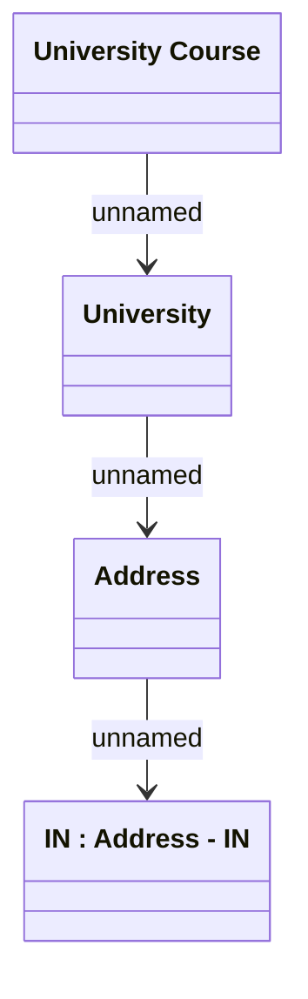

# University address

- **Diagram Type**: Logical
- **Package**: HomerSelect/BSL/Analysis Model/Client Management/COMMON for Client Management/Logical Data Model/Enums&Types
- **Diagram ID**: 152283
- **Elements**: 4
- **Connectors**: 3

