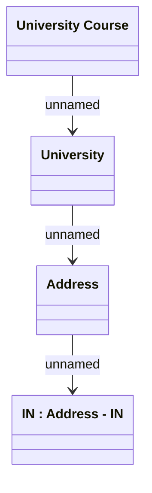

# University address

```mermaid
classDiagram
    class IN_Address_IN["IN : Address - IN"]
    class Address["Address"]
    class University_Course["University Course"]
    class University["University"]
    University_Course --> University : unnamed
    University --> Address : unnamed
    Address --> IN_Address_IN : unnamed
```
