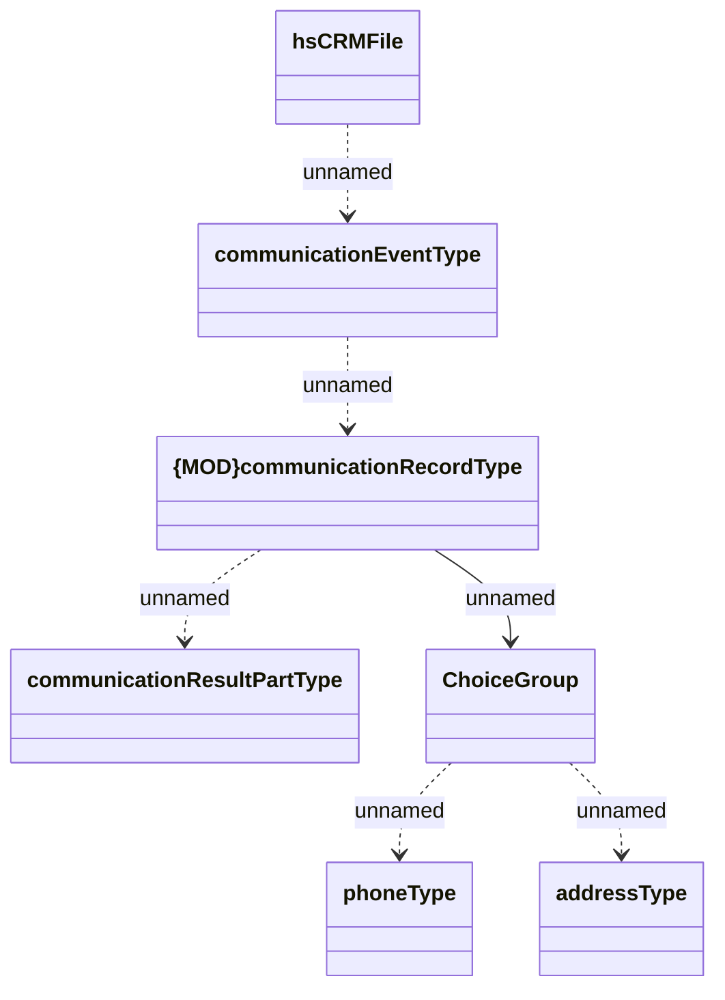

# CRMFile

- **Diagram Type**: Logical
- **Package**: HomerSelect/BSL/Analysis Model/Client Management/Communication/Import list of communication/Interface/hsCRMFile
- **Diagram ID**: 131458
- **Elements**: 7
- **Connectors**: 6

