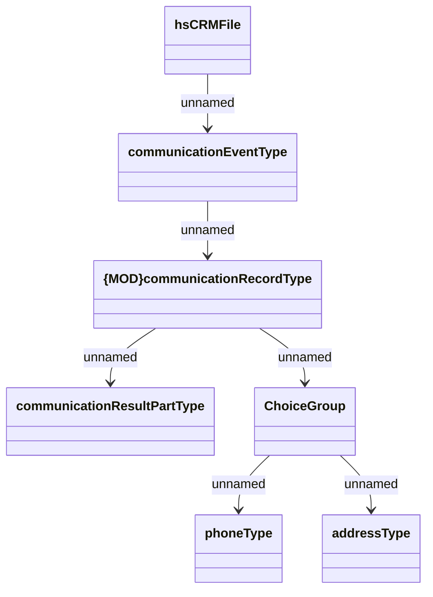

# CRMFile

```mermaid
classDiagram
    class communicationResultPartType["communicationResultPartType"]
    class addressType["addressType"]
    class phoneType["phoneType"]
    class ChoiceGroup["ChoiceGroup"]
    class MOD_communicationRecordType["{MOD}communicationRecordType"]
    class communicationEventType["communicationEventType"]
    class hsCRMFile["hsCRMFile"]
    hsCRMFile --> communicationEventType : unnamed
    communicationEventType --> MOD_communicationRecordType : unnamed
    MOD_communicationRecordType --> ChoiceGroup : unnamed
    ChoiceGroup --> phoneType : unnamed
    ChoiceGroup --> addressType : unnamed
    MOD_communicationRecordType --> communicationResultPartType : unnamed
```
