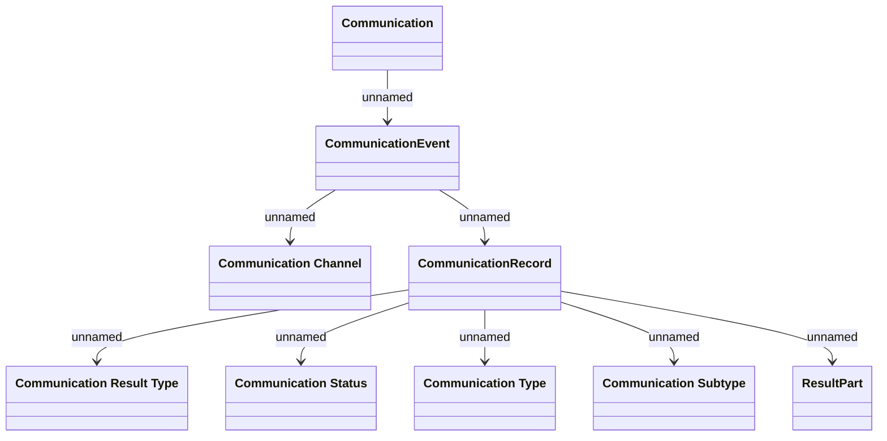

# Creating Communication

```mermaid
classDiagram
    class ResultPart["ResultPart"]
    class Communication["Communication"]
    class Communication_Subtype["Communication Subtype"]
    class Communication_Type["Communication Type"]
    class Communication_Status["Communication Status"]
    class Communication_Result_Type["Communication Result Type"]
    class Communication_Channel["Communication Channel"]
    class CommunicationEvent["CommunicationEvent"]
    class CommunicationRecord["CommunicationRecord"]
    CommunicationEvent --> CommunicationRecord : unnamed
    Communication --> CommunicationEvent : unnamed
    CommunicationEvent --> Communication_Channel : unnamed
    CommunicationRecord --> Communication_Result_Type : unnamed
    CommunicationRecord --> Communication_Status : unnamed
    CommunicationRecord --> Communication_Type : unnamed
    CommunicationRecord --> Communication_Subtype : unnamed
    CommunicationRecord --> ResultPart : unnamed
```
