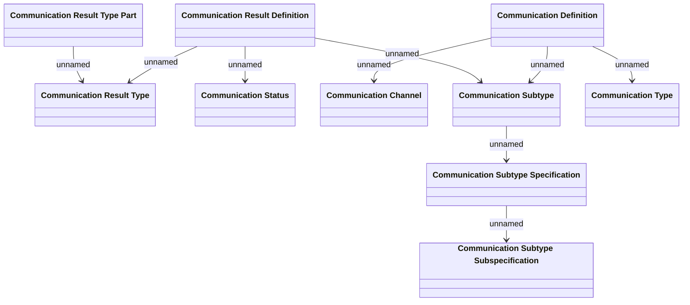

# Communication definition LDM

- **Diagram Type**: Logical
- **Package**: HomerSelect/BSL/Analysis Model/Client Management/Communication/Manage communication/Logical Data Model
- **Diagram ID**: 140374
- **Elements**: 10
- **Connectors**: 9

