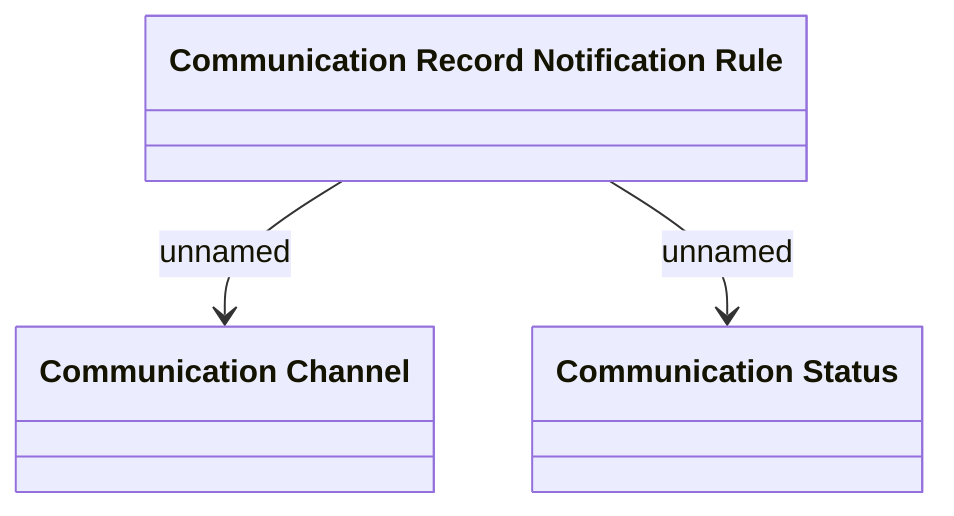

# Communication record notification setting

```mermaid
classDiagram
    class Communication_Status["Communication Status"]
    class Communication_Channel["Communication Channel"]
    class Communication_Record_Notification_Rule["Communication Record Notification Rule"]
    Communication_Record_Notification_Rule --> Communication_Channel : unnamed
    Communication_Record_Notification_Rule --> Communication_Status : unnamed
```
