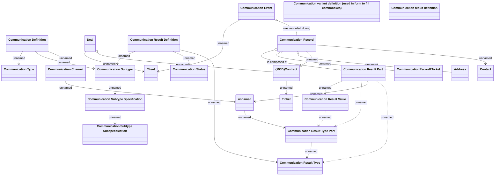

# Communication

- **Diagram Type**: Logical
- **Package**: HomerSelect/BSL/Analysis Model/Client Management/Communication/Manage communication/Logical Data Model
- **Diagram ID**: 140373
- **Elements**: 27
- **Connectors**: 26

