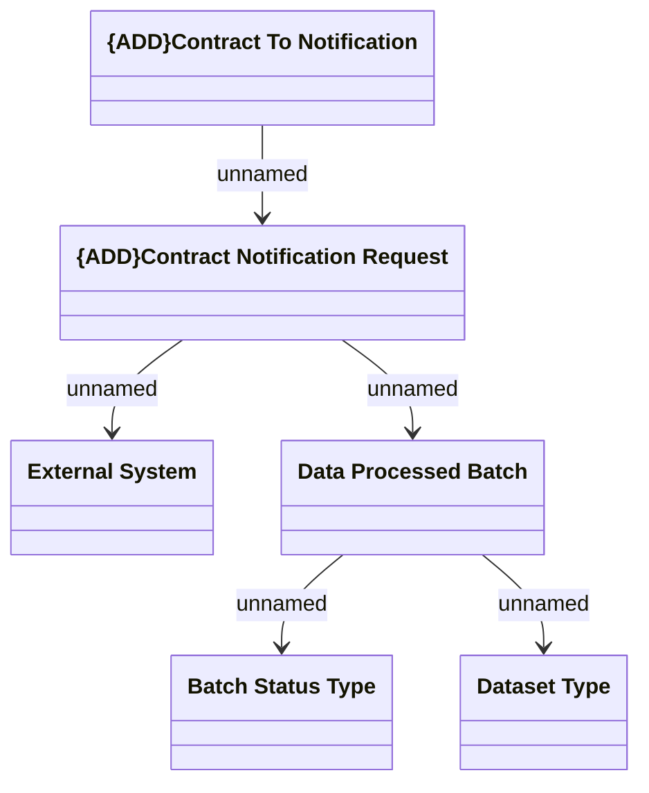

# Processing Contract notification resending request

```mermaid
classDiagram
    class External_System["External System"]
    class ADD_Contract_To_Notification["{ADD}Contract To Notification"]
    class ADD_Contract_Notification_Request["{ADD}Contract Notification Request"]
    class Dataset_Type["Dataset Type"]
    class Batch_Status_Type["Batch Status Type"]
    class Data_Processed_Batch["Data Processed Batch"]
    ADD_Contract_Notification_Request --> External_System : unnamed
    ADD_Contract_Notification_Request --> Data_Processed_Batch : unnamed
    ADD_Contract_To_Notification --> ADD_Contract_Notification_Request : unnamed
    Data_Processed_Batch --> Batch_Status_Type : unnamed
    Data_Processed_Batch --> Dataset_Type : unnamed
```
