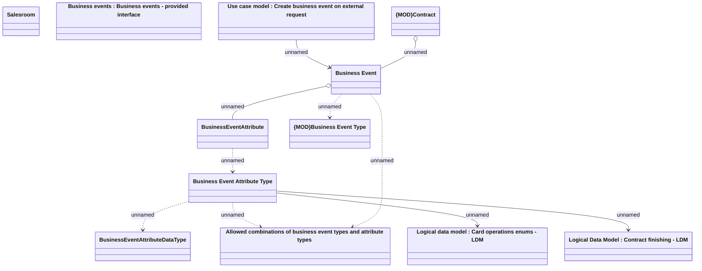

# Business event - Logical data model

- **Diagram Type**: Logical
- **Package**: HomerSelect/BSL/Analysis Model/Contract Management/Business events/Logical data model
- **Diagram ID**: 161138
- **Elements**: 12
- **Connectors**: 10

