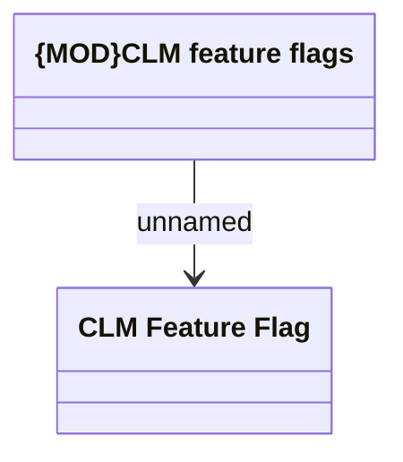

# CLM Feature Flags

- **Diagram Type**: Logical
- **Package**: HomerSelect/BSL/Analysis Model/Contract Management/CLM Feature Flags
- **Diagram ID**: 157941
- **Elements**: 2
- **Connectors**: 1

```mermaid
classDiagram
    class MOD_CLM_feature_flags["{MOD}CLM feature flags"]
    class CLM_Feature_Flag["CLM Feature Flag"]
    MOD_CLM_feature_flags --> CLM_Feature_Flag : unnamed
```
