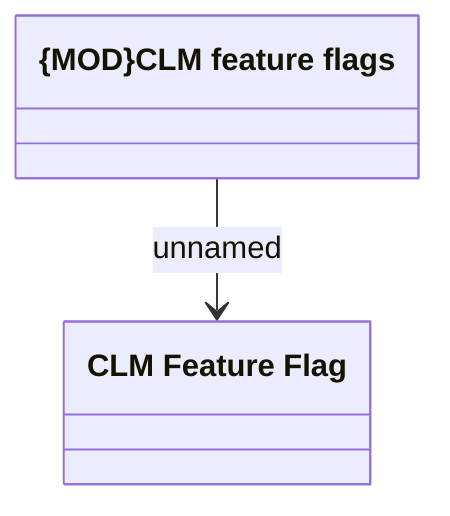

# CLM Feature Flags

```mermaid
classDiagram
    class MOD_CLM_feature_flags["{MOD}CLM feature flags"]
    class CLM_Feature_Flag["CLM Feature Flag"]
    MOD_CLM_feature_flags --> CLM_Feature_Flag : unnamed
```
