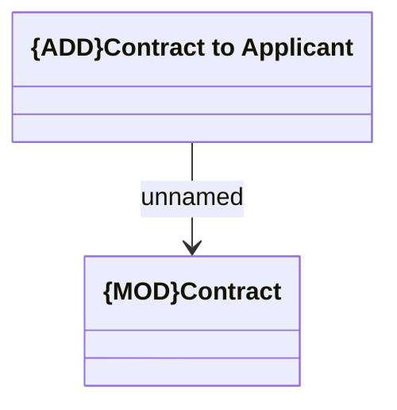

# Contract - Applicant

```mermaid
classDiagram
    class ADD_Contract_to_Applicant["{ADD}Contract to Applicant"]
    class MOD_Contract["{MOD}Contract"]
    ADD_Contract_to_Applicant --> MOD_Contract : unnamed
```
