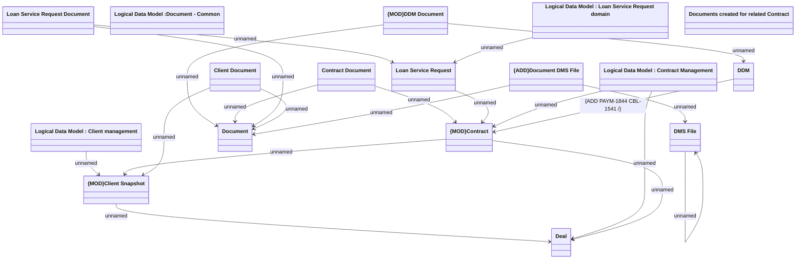

# Contract - Document

```mermaid
classDiagram
    class ADD_Document_DMS_File["{ADD}Document DMS File"]
    class Logical_Data_Model_Loan_Service_Request_domain["Logical Data Model : Loan Service Request domain"]
    class Loan_Service_Request["Loan Service Request"]
    class Logical_Data_Model_Document_Common["Logical Data Model :Document - Common"]
    class MOD_Contract["{MOD}Contract"]
    class Logical_Data_Model_Client_management["Logical Data Model : Client management"]
    class Deal["Deal"]
    class Loan_Service_Request_Document["Loan Service Request Document"]
    class Logical_Data_Model_Contract_Management["Logical Data Model : Contract Management"]
    class DDM["DDM"]
    class MOD_Client_Snapshot["{MOD}Client Snapshot"]
    class Contract_Document["Contract Document"]
    class MOD_DDM_Document["{MOD}DDM Document"]
    class Client_Document["Client Document"]
    class Document["Document"]
    class Documents_created_for_related_Contract["Documents created for related Contract"]
    class DMS_File["DMS File"]
    Logical_Data_Model_Client_management --> MOD_Client_Snapshot : unnamed
    Loan_Service_Request_Document --> Loan_Service_Request : unnamed
    Contract_Document --> MOD_Contract : unnamed
    Loan_Service_Request --> MOD_Contract : unnamed
    Logical_Data_Model_Contract_Management --> MOD_Contract : unnamed
    DDM --> MOD_Contract : {ADD PAYM-1844 CBL-1541 /}
    MOD_Client_Snapshot --> Deal : unnamed
    Logical_Data_Model_Contract_Management --> Deal : unnamed
    Logical_Data_Model_Loan_Service_Request_domain --> Loan_Service_Request : unnamed
    MOD_DDM_Document --> DDM : unnamed
    ADD_Document_DMS_File --> DMS_File : unnamed
    MOD_Contract --> MOD_Client_Snapshot : unnamed
    Client_Document --> MOD_Client_Snapshot : unnamed
    MOD_DDM_Document --> Document : unnamed
    Contract_Document --> Document : unnamed
    Loan_Service_Request_Document --> Document : unnamed
    Client_Document --> Document : unnamed
    DMS_File --> DMS_File : unnamed
    MOD_Contract --> Deal : unnamed
    ADD_Document_DMS_File --> Document : unnamed
```
