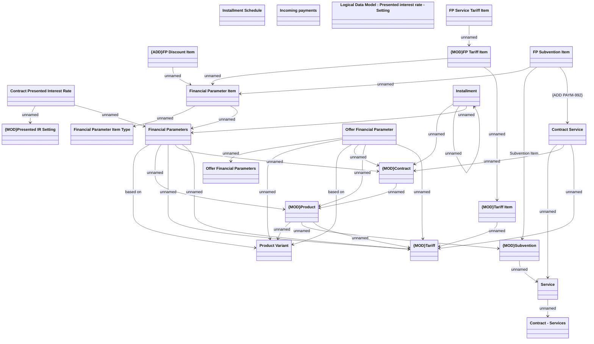

# Contract - Financial parameters

```mermaid
classDiagram
    class ADD_FP_Discount_Item["{ADD}FP Discount Item"]
    class Contract_Service["Contract Service"]
    class Installment_Schedule["Installment Schedule"]
    class Incoming_payments["Incoming payments"]
    class Logical_Data_Model_Presented_interest_rate_Setting["Logical Data Model : Presented interest rate - Setting"]
    class MOD_Presented_IR_Setting["{MOD}Presented IR Setting"]
    class Contract_Presented_Interest_Rate["Contract Presented Interest Rate"]
    class Product_Variant["Product Variant"]
    class Offer_Financial_Parameters["Offer Financial Parameters"]
    class Contract_Services["Contract - Services"]
    class FP_Service_Tariff_Item["FP Service Tariff Item"]
    class Service["Service"]
    class MOD_Subvention["{MOD}Subvention"]
    class MOD_FP_Tariff_Item["{MOD}FP Tariff Item"]
    class FP_Subvention_Item["FP Subvention Item"]
    class Financial_Parameter_Item_Type["Financial Parameter Item Type"]
    class Financial_Parameter_Item["Financial Parameter Item"]
    class Offer_Financial_Parameter["Offer Financial Parameter"]
    class Financial_Parameters["Financial Parameters"]
    class MOD_Tariff_Item["{MOD}Tariff Item"]
    class MOD_Tariff["{MOD}Tariff"]
    class MOD_Product["{MOD}Product"]
    class Installment["Installment"]
    class MOD_Contract["{MOD}Contract"]
    Service --> Contract_Services : unnamed
    Contract_Service --> Service : unnamed
    FP_Subvention_Item --> Financial_Parameter_Item : unnamed
    MOD_FP_Tariff_Item --> Financial_Parameter_Item : unnamed
    ADD_FP_Discount_Item --> Financial_Parameter_Item : unnamed
    Financial_Parameter_Item --> Financial_Parameter_Item_Type : unnamed
    FP_Service_Tariff_Item --> MOD_FP_Tariff_Item : unnamed
    FP_Subvention_Item --> MOD_Subvention : Subvention Item
    FP_Subvention_Item --> Contract_Service : {ADD PAYM-992}
    Financial_Parameter_Item --> Financial_Parameters : unnamed
    Offer_Financial_Parameter --> Offer_Financial_Parameters : unnamed
    Financial_Parameters --> Product_Variant : based on
    Offer_Financial_Parameter --> Product_Variant : unnamed
    Offer_Financial_Parameter --> Product_Variant : based on
    MOD_Product --> Product_Variant : unnamed
    Contract_Presented_Interest_Rate --> MOD_Presented_IR_Setting : unnamed
    MOD_Product --> MOD_Subvention : unnamed
    MOD_Tariff_Item --> MOD_Tariff : unnamed
    Offer_Financial_Parameter --> MOD_Contract : unnamed
    Contract_Service --> MOD_Contract : unnamed
    Installment --> MOD_Contract : unnamed
    Installment --> Installment : unnamed
    Financial_Parameters --> MOD_Product : unnamed
    Offer_Financial_Parameter --> MOD_Product : unnamed
    MOD_Contract --> MOD_Product : unnamed
    Contract_Presented_Interest_Rate --> Financial_Parameters : unnamed
    Installment --> Financial_Parameters : unnamed
    Contract_Service --> MOD_Tariff : unnamed
    Offer_Financial_Parameter --> MOD_Tariff : unnamed
    Financial_Parameters --> MOD_Tariff : unnamed
    MOD_Product --> MOD_Tariff : unnamed
    MOD_FP_Tariff_Item --> MOD_Tariff_Item : unnamed
    Financial_Parameters --> MOD_Contract : unnamed
    Financial_Parameters --> MOD_Tariff : unnamed
    MOD_Subvention --> Service : unnamed
```
