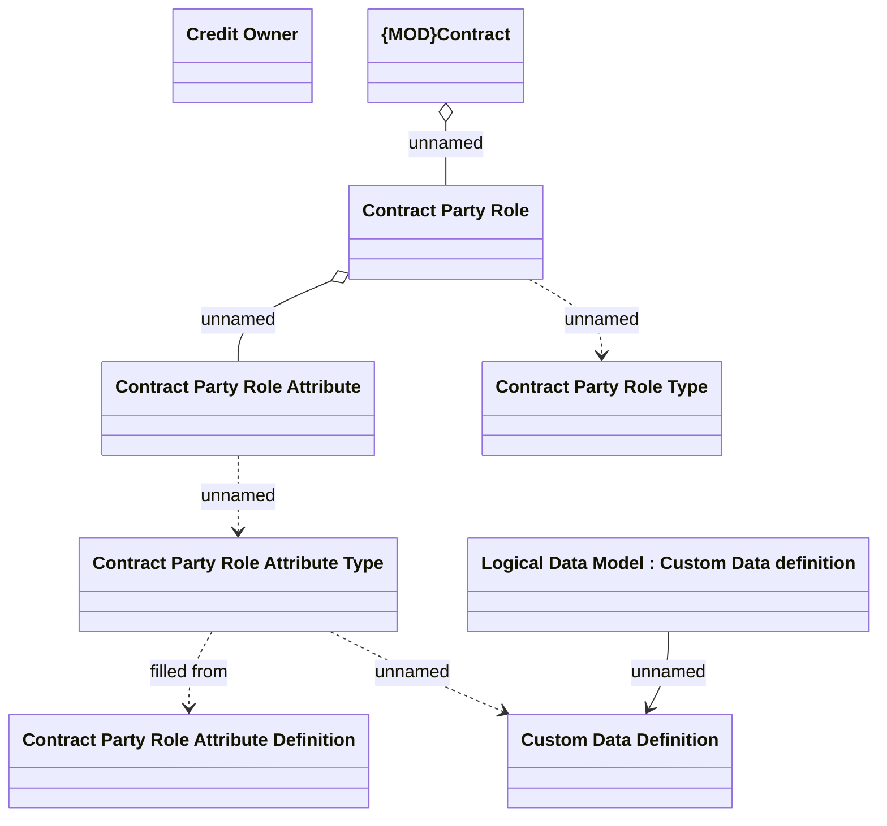

# Contract - Party roles

- **Diagram Type**: Logical
- **Package**: HomerSelect/BSL/Analysis Model/Contract Management/COMMON for Contract Management/Logical Data Model
- **Diagram ID**: 164487
- **Elements**: 9
- **Connectors**: 8

