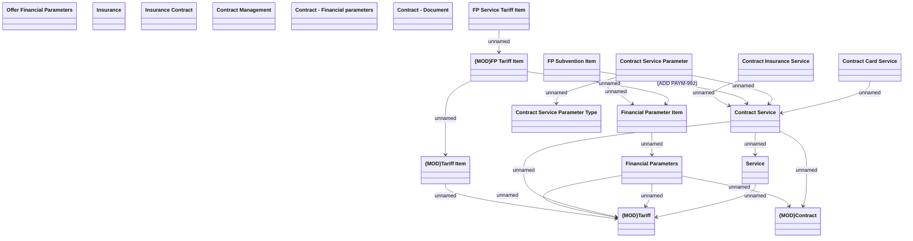

# Contract - Services

```mermaid
classDiagram
    class Contract_Card_Service["Contract Card Service"]
    class FP_Subvention_Item["FP Subvention Item"]
    class Contract_Service_Parameter["Contract Service Parameter"]
    class Contract_Service["Contract Service"]
    class Offer_Financial_Parameters["Offer Financial Parameters"]
    class Contract_Service_Parameter_Type["Contract Service Parameter Type"]
    class Contract_Service["Contract Service"]
    class Insurance["Insurance"]
    class Insurance_Contract["Insurance Contract"]
    class Contract_Management["Contract Management"]
    class Contract_Financial_parameters["Contract - Financial parameters"]
    class Contract_Document["Contract - Document"]
    class MOD_Tariff["{MOD}Tariff"]
    class MOD_FP_Tariff_Item["{MOD}FP Tariff Item"]
    class Financial_Parameters["Financial Parameters"]
    class Financial_Parameter_Item["Financial Parameter Item"]
    class FP_Service_Tariff_Item["FP Service Tariff Item"]
    class MOD_Tariff_Item["{MOD}Tariff Item"]
    class Service["Service"]
    class Contract_Insurance_Service["Contract Insurance Service"]
    class MOD_Contract["{MOD}Contract"]
    MOD_Tariff_Item --> MOD_Tariff : unnamed
    Contract_Insurance_Service --> Contract_Service : unnamed
    FP_Subvention_Item --> Contract_Service : {ADD PAYM-992}
    Contract_Service_Parameter --> Contract_Service : unnamed
    Contract_Service_Parameter --> Contract_Service_Parameter_Type : unnamed
    Financial_Parameters --> MOD_Tariff : unnamed
    Contract_Service --> MOD_Tariff : unnamed
    Contract_Card_Service --> Contract_Service : unnamed
    Financial_Parameters --> MOD_Contract : unnamed
    FP_Service_Tariff_Item --> MOD_FP_Tariff_Item : unnamed
    Financial_Parameter_Item --> Financial_Parameters : unnamed
    FP_Subvention_Item --> Financial_Parameter_Item : unnamed
    MOD_FP_Tariff_Item --> Financial_Parameter_Item : unnamed
    MOD_FP_Tariff_Item --> MOD_Tariff_Item : unnamed
    Contract_Service --> Service : unnamed
    Contract_Service --> MOD_Contract : unnamed
    Financial_Parameters --> MOD_Tariff : unnamed
    Service --> MOD_Tariff : unnamed
```
