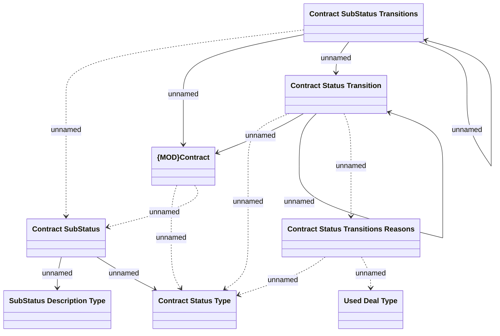

# Contract - Status

- **Diagram Type**: Logical
- **Package**: HomerSelect/BSL/Analysis Model/Contract Management/COMMON for Contract Management/Logical Data Model
- **Diagram ID**: 164481
- **Elements**: 8
- **Connectors**: 14

