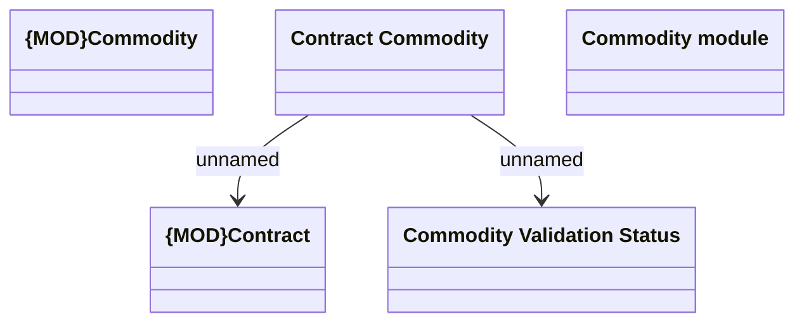

# Contract Commodity

```mermaid
classDiagram
    class Commodity_Validation_Status["Commodity Validation Status"]
    class MOD_Commodity["{MOD}Commodity"]
    class MOD_Contract["{MOD}Contract"]
    class Contract_Commodity["Contract Commodity"]
    class Commodity_module["Commodity module"]
    Contract_Commodity --> MOD_Contract : unnamed
    Contract_Commodity --> Commodity_Validation_Status : unnamed
```
