# Contract Management

- **Diagram Type**: Logical
- **Package**: HomerSelect/BSL/Analysis Model/Contract Management/COMMON for Contract Management/Logical Data Model
- **Diagram ID**: 164480
- **Elements**: 46
- **Connectors**: 53

```mermaid
classDiagram
    class ADD_Contract_to_Applicant["{ADD}Contract to Applicant"]
    class Outgoing_Payment["Outgoing Payment"]
    class Agreement_Data_Source["Agreement Data Source"]
    class Contract_to_DDM["Contract to DDM"]
    class Contract_to_Payment_Channel["Contract to Payment Channel"]
    class External_Identification_Attribute_Type["External Identification Attribute Type"]
    class External_Identifier["External Identifier"]
    class MOD_Payment_Channel["{MOD}Payment Channel"]
    class Contract_Commodity["Contract Commodity"]
    class User_Statistics["User Statistics"]
    class MOD_Contract["{MOD}Contract"]
    class Contract_Status_Transition_Request_Type["Contract Status Transition Request Type"]
    class Contract_Status_Transition_Request_Status_Type["Contract Status Transition Request Status Type"]
    class Contract_Status_Transition_Request["Contract Status Transition Request"]
    class Bank_Branch["Bank Branch"]
    class MOD_Refinanced_Contract["{MOD}Refinanced Contract "]
    class Logical_Data_Model_Penalty_Over_Limit["Logical Data Model : Penalty Over Limit"]
    class Penalty_Over_Limit["Penalty Over Limit"]
    class Contract_Bank_Account["Contract Bank Account"]
    class Bank_Account["Bank Account"]
    class Client_Possession["Client Possession"]
    class Security_Question["Security Question"]
    class MOD_Saving_of_Payment_Channels["{MOD}Saving of Payment Channels"]
    class Logical_Data_Model_Payment_Channels["Logical Data Model : Payment Channels"]
    class DMS_File["DMS File"]
    class MOD_Temporary_Application["{MOD}Temporary Application"]
    class Client_Snapshot_Contact["Client Snapshot Contact"]
    class Contact["Contact"]
    class Business_Event["Business Event"]
    class DDM_Change_Request["DDM Change Request"]
    class Client_Other_Information["Client Other Information"]
    class Document_Attribute["Document Attribute"]
    class Salesroom["Salesroom"]
    class Client["Client"]
    class MOD_DDM_Document["{MOD}DDM Document"]
    class Client_Document["Client Document"]
    class Contract_Document["Contract Document"]
    class Deal["Deal"]
    class Agreement["Agreement"]
    class Communication_Record["Communication Record"]
    class Contract_Package_Item["Contract Package Item"]
    class DDM["DDM"]
    class Contract_Package["Contract Package"]
    class Document["Document"]
    class MOD_Client_Snapshot["{MOD}Client Snapshot"]
    MOD_Contract o-- Contract_to_Payment_Channel : unnamed
    DDM ..> Bank_Account : unnamed
    Bank_Account --> Bank_Branch : {DEL CBL-4414 PAYM-1613 /}
    Contract_Status_Transition_Request ..> Contract_Status_Transition_Request_Status_Type : unnamed
    Contract_Status_Transition_Request ..> Contract_Status_Transition_Request_Type : unnamed
    MOD_Contract o-- Contract_Bank_Account : unnamed
    MOD_Contract o-- Contract_Commodity : unnamed
    MOD_Contract o-- User_Statistics : unnamed
    DDM --> MOD_Contract : {ADD PAYM-1844 CBL-1541 /}
    MOD_Contract o-- Contract_Status_Transition_Request : unnamed
    MOD_Contract o-- External_Identifier : unnamed
    Outgoing_Payment --> Outgoing_Payment : unnamed
    MOD_Contract o-- Penalty_Over_Limit : unnamed
    MOD_Payment_Channel --> Bank_Account : {DEL CBL-4414 PAYM-1613 /}
    MOD_Contract o-- Contract_to_DDM : unnamed
    MOD_Contract o-- Client_Possession : unnamed
    MOD_Contract o-- Security_Question : unnamed
    Outgoing_Payment --> MOD_Contract : unnamed
    Communication_Record --> MOD_Contract : unnamed
    MOD_Contract o-- Contract_Document : unnamed
    MOD_Contract o-- Business_Event : unnamed
    MOD_Contract o-- ADD_Contract_to_Applicant : unnamed
    Outgoing_Payment --> MOD_Payment_Channel : unnamed
    External_Identifier ..> External_Identification_Attribute_Type : unnamed
    Agreement --> Agreement_Data_Source : {ADD LOR-4530/} has
    MOD_Contract o-- MOD_Refinanced_Contract : unnamed
    Deal o-- MOD_Client_Snapshot : unnamed
    MOD_Client_Snapshot o-- Client_Document : unnamed
    MOD_Client_Snapshot o-- Client_Snapshot_Contact : unnamed
    MOD_DDM_Document --> Document : unnamed
    Client_Document --> Document : unnamed
    Contract_Document --> Document : unnamed
    Contract_Package o-- Contract_Package_Item : unnamed
    MOD_DDM_Document --> DDM : unnamed
    DDM o-- Bank_Account : {DEL CBL-4414 PAYM-1613 /}
    DDM o-- DDM_Change_Request : unnamed
    MOD_Contract --> Contract_Package_Item : unnamed
    Contract_Bank_Account --> Bank_Account : unnamed
    Deal o-- MOD_Contract : unnamed
    MOD_Payment_Channel --> Bank_Account : {DEL CBL-4414 PAYM-1613 /}
    Deal o-- Client_Other_Information : unnamed
    MOD_Client_Snapshot --> Client : unnamed
    Deal --> Client : unnamed
    Communication_Record --> Contact : unnamed
    Client_Snapshot_Contact --> Contact : unnamed
    MOD_Temporary_Application o-- External_Identifier : unnamed
    MOD_Contract --> MOD_Temporary_Application : unnamed
    DMS_File --> DMS_File : unnamed
    Agreement --> DMS_File : has
    MOD_Payment_Channel ..> MOD_Saving_of_Payment_Channels : unnamed
    MOD_Contract --> MOD_Client_Snapshot : unnamed
    MOD_Contract --> Agreement : unnamed
    Document_Attribute --> Document : unnamed
```

