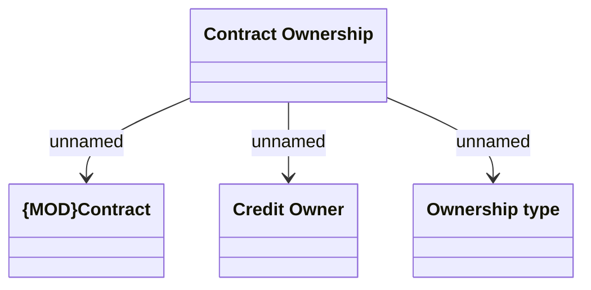

# Contract ownership

```mermaid
classDiagram
    class Ownership_type["Ownership type"]
    class Credit_Owner["Credit Owner"]
    class Contract_Ownership["Contract Ownership"]
    class MOD_Contract["{MOD}Contract"]
    Contract_Ownership --> MOD_Contract : unnamed
    Contract_Ownership --> Credit_Owner : unnamed
    Contract_Ownership --> Ownership_type : unnamed
```
