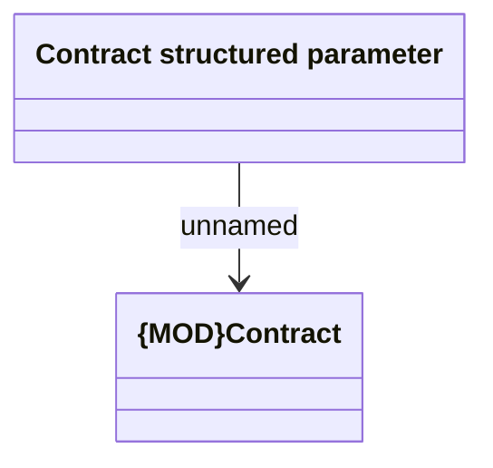

# Contract structured parameter

```mermaid
classDiagram
    class MOD_Contract["{MOD}Contract"]
    class Contract_structured_parameter["Contract structured parameter"]
    Contract_structured_parameter --> MOD_Contract : unnamed
```
