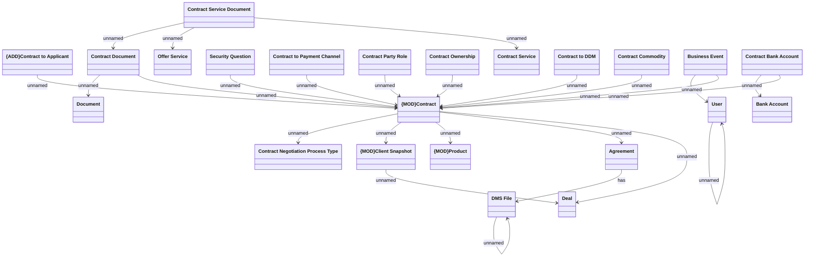

# Contract

```mermaid
classDiagram
    class MOD_Product["{MOD}Product"]
    class Contract_Negotiation_Process_Type["Contract Negotiation Process Type"]
    class ADD_Contract_to_Applicant["{ADD}Contract to Applicant"]
    class Document["Document"]
    class Offer_Service["Offer Service"]
    class Contract_Service["Contract Service"]
    class Contract_Service_Document["Contract Service Document"]
    class User["User"]
    class Bank_Account["Bank Account"]
    class DMS_File["DMS File"]
    class MOD_Client_Snapshot["{MOD}Client Snapshot"]
    class Deal["Deal"]
    class Security_Question["Security Question"]
    class Contract_to_Payment_Channel["Contract to Payment Channel"]
    class Contract_Party_Role["Contract Party Role"]
    class Contract_Ownership["Contract Ownership"]
    class Contract_Document["Contract Document"]
    class Contract_to_DDM["Contract to DDM"]
    class Contract_Commodity["Contract Commodity"]
    class Business_Event["Business Event"]
    class Contract_Bank_Account["Contract Bank Account"]
    class Agreement["Agreement"]
    class MOD_Contract["{MOD}Contract"]
    Contract_Service_Document --> Contract_Document : unnamed
    MOD_Contract --> Contract_Negotiation_Process_Type : unnamed
    Contract_Document --> Document : unnamed
    Contract_Service_Document --> Offer_Service : unnamed
    Contract_Service_Document --> Contract_Service : unnamed
    Business_Event --> User : unnamed
    User --> User : unnamed
    Contract_Bank_Account --> Bank_Account : unnamed
    Agreement --> DMS_File : has
    DMS_File --> DMS_File : unnamed
    MOD_Contract --> MOD_Client_Snapshot : unnamed
    MOD_Contract --> MOD_Product : unnamed
    MOD_Client_Snapshot --> Deal : unnamed
    ADD_Contract_to_Applicant --> MOD_Contract : unnamed
    MOD_Contract --> Agreement : unnamed
    Contract_Document --> MOD_Contract : unnamed
    Contract_Ownership --> MOD_Contract : unnamed
    Contract_Bank_Account --> MOD_Contract : unnamed
    Contract_Party_Role --> MOD_Contract : unnamed
    Business_Event --> MOD_Contract : unnamed
    Contract_Commodity --> MOD_Contract : unnamed
    Contract_to_DDM --> MOD_Contract : unnamed
    Contract_to_Payment_Channel --> MOD_Contract : unnamed
    Security_Question --> MOD_Contract : unnamed
    MOD_Contract --> Deal : unnamed
```
