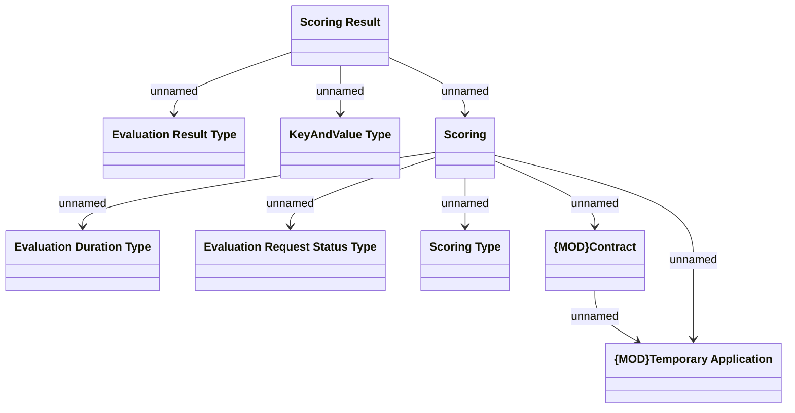

# Scoring

```mermaid
classDiagram
    class MOD_Temporary_Application["{MOD}Temporary Application"]
    class Evaluation_Result_Type["Evaluation Result Type"]
    class Evaluation_Duration_Type["Evaluation Duration Type"]
    class Evaluation_Request_Status_Type["Evaluation Request Status Type"]
    class KeyAndValue_Type["KeyAndValue Type"]
    class Scoring_Type["Scoring Type"]
    class Scoring["Scoring"]
    class Scoring_Result["Scoring Result"]
    class MOD_Contract["{MOD}Contract"]
    Scoring --> MOD_Contract : unnamed
    Scoring_Result --> Scoring : unnamed
    Scoring --> Scoring_Type : unnamed
    Scoring_Result --> KeyAndValue_Type : unnamed
    Scoring --> Evaluation_Request_Status_Type : unnamed
    Scoring --> Evaluation_Duration_Type : unnamed
    Scoring_Result --> Evaluation_Result_Type : unnamed
    MOD_Contract --> MOD_Temporary_Application : unnamed
    Scoring --> MOD_Temporary_Application : unnamed
```
