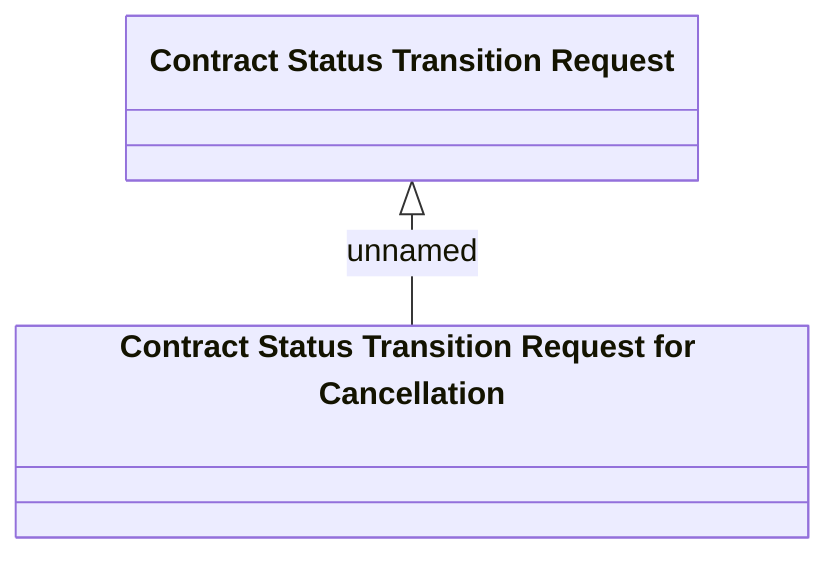

# Contract cancellation - Logical data model

- **Diagram Type**: Logical
- **Package**: HomerSelect/BSL/Analysis Model/Contract Management/Contract cancellation/Logical data model
- **Diagram ID**: 134364
- **Elements**: 2
- **Connectors**: 1

