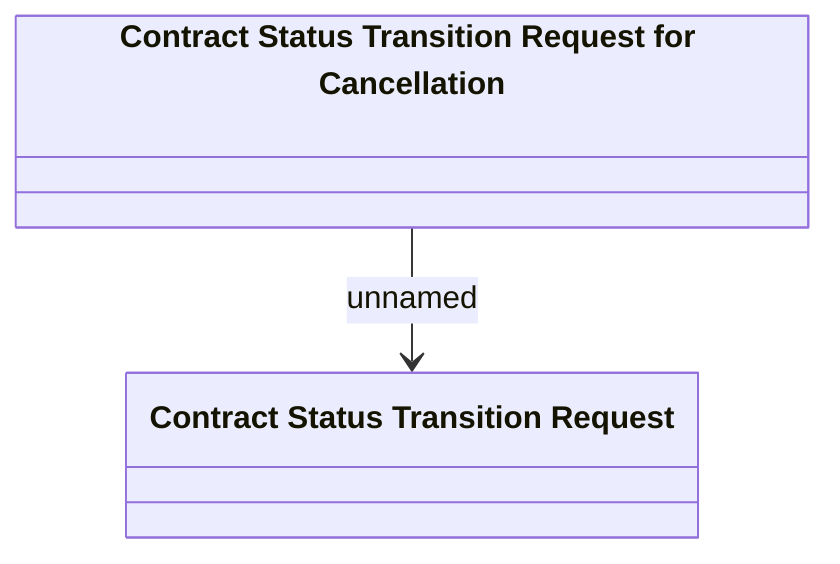

# Contract cancellation - Logical data model

```mermaid
classDiagram
    class Contract_Status_Transition_Request_for_Cancellation["Contract Status Transition Request for Cancellation"]
    class Contract_Status_Transition_Request["Contract Status Transition Request"]
    Contract_Status_Transition_Request_for_Cancellation --> Contract_Status_Transition_Request : unnamed
```
