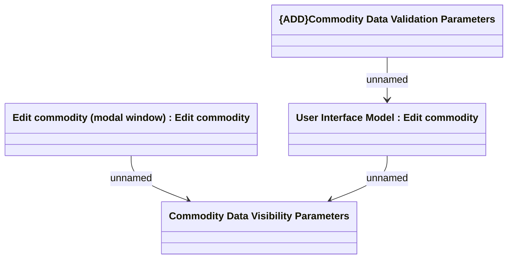

# Edit Commodity Customization

- **Diagram Type**: Logical
- **Package**: HomerSelect/BSL/Analysis Model/Contract Management/Contract commodities management/Customization
- **Diagram ID**: 134371
- **Elements**: 4
- **Connectors**: 3

