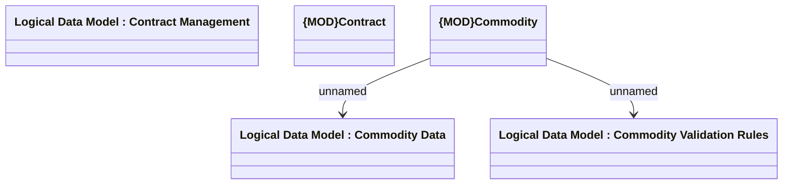

# Contract - Commodity

```mermaid
classDiagram
    class Logical_Data_Model_Commodity_Validation_Rules["Logical Data Model : Commodity Validation Rules"]
    class Logical_Data_Model_Commodity_Data["Logical Data Model : Commodity Data"]
    class Logical_Data_Model_Contract_Management["Logical Data Model : Contract Management"]
    class MOD_Contract["{MOD}Contract"]
    class MOD_Commodity["{MOD}Commodity"]
    MOD_Commodity --> Logical_Data_Model_Commodity_Data : unnamed
    MOD_Commodity --> Logical_Data_Model_Commodity_Validation_Rules : unnamed
```
