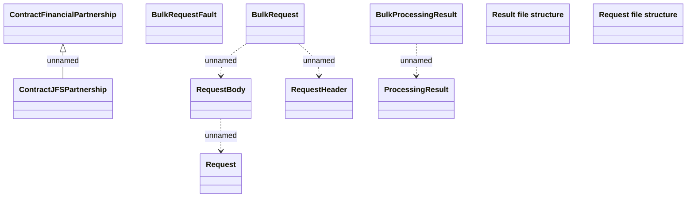

# Set financial partnership - File schema

- **Diagram Type**: Logical
- **Package**: HomerSelect/BSL/Analysis Model/Contract Management/Contract financial partnership/Interface
- **Diagram ID**: 101801
- **Elements**: 11
- **Connectors**: 5

